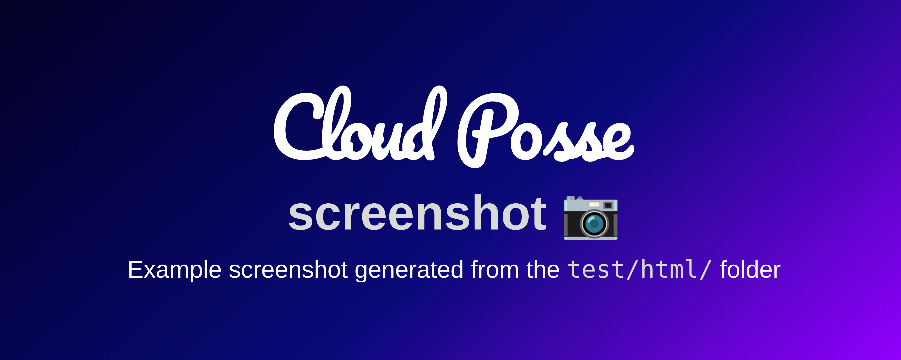

[](https://docs.stepsecurity.io/actions/stepsecurity-maintained-actions)

<!-- markdownlint-disable -->
# screenshot <a href="https://cpco.io/homepage?utm_source=github&utm_medium=readme&utm_campaign=step-security/cloudposse-github-actions-screenshot&utm_content="></a>
<a href="https://github.com/step-security/cloudposse-github-actions-screenshot/releases/latest"></a><a href="https://slack.cloudposse.com"></a>
<!-- markdownlint-restore -->


This GitHub Action will use Puppeteer to generate screenshots from any URL or even a `file://`. It's great for creating dynamic banners for GitHub projects.

## Screenshots

*<br/>Example of a screenshot generated by this action from the [`test/html`](test/html) HTML.*


## Introduction

This action generates a screenshot of any website (including file://) using Puppeteer.

## Usage

> [!IMPORTANT]
> In StepSecurity's examples, we avoid pinning GitHub Actions to specific versions to prevent discrepancies between the documentation 
> and the latest released versions. However, for your own projects, we strongly advise pinning each GitHub Action to the exact version
> you're using. This practice ensures the stability of your workflows. Additionally, we recommend implementing a systematic 
> approach for updating versions to avoid unexpected changes.


For a complete working example that generated the demo image, see the [`.github/workflows/test.yaml`](.github/workflows/test.yaml) workflow.

```yaml
name: Generate Screenshot

on:
  pull_request:
    types: [opened, synchronize, reopened]

jobs:
  screenshot:
    runs-on: ubuntu-latest
    concurrency:
    group: ${{ github.workflow }}-${{ github.event.pull_request.number || github.ref }}
    cancel-in-progress: true

    steps:
    - uses: actions/checkout@7
    - name: Run this composite action
      id: screenshot
      uses: step-security/cloudposse-github-actions-screenshot@v1
      with:
        url: "file://${{github.workspace}}/test/html/index.html"
        output: "docs/example.png"
        
        # Overwrite any CSS
        css: |
          body {
            background: rgb(2,0,36);
            background: linear-gradient(139deg, rgba(2,0,36,1) 0%, rgba(9,9,121,1) 56%, rgba(147,0,255,1) 100%);
          }

        # Replace any text using JQuery-style CSS path selectors" 
        customizations: |
          "#name": "${{ github.event.repository.name }}"        

        # Set the width & height of the viewport
        viewportWidth: 800
        viewportHeight: 600
 ```


<!-- markdownlint-disable -->

## Inputs

| Name | Description | Default | Required |
|------|-------------|---------|----------|
| consoleOutputEnabled | Whether or not to output the browser console log | true | false |
| css | Custom CSS overrides | N/A | false |
| customizations | String representation of a YAML or JSON map of CSS paths (key) and replacement (value) | N/A | false |
| deviceScaleFactor | Specifies the device scale factor (pixel ratio) for the web page rendering. It determines how many physical pixels are used to represent a single logical pixel. For example, a device scale factor of 2 means one logical pixel is represented by two physical pixels, commonly used for high-DPI (Retina) displays. A value of 1 uses standard pixel density. This factor affects the resolution and quality of the rendered page or screenshot. | 2 | false |
| fullPage | Screen capture the entire page by scrolling down | false | false |
| imageQuality | Quality of the output image (1-100, applicable for JPEG) | N/A | false |
| omitBackground | Omit the browser default background. Enable to support transparency. | true | false |
| output | Output image file path | screenshot.png | false |
| outputType | Output image type | png | false |
| puppeteerImage | Docker image to run puppeteer. See https://github.com/puppeteer/puppeteer/pkgs/container/puppeteer | ghcr.io/puppeteer/puppeteer:22.13.1 | false |
| url | URL of the HTML content to convert to an image. Use file:// for local files | N/A | true |
| viewportHeight | Viewport height in pixels | N/A | true |
| viewportWidth | Viewport width in pixels | N/A | true |
| waitForTimeout | Number of milliseconds to delay before taking screenshot | 500 | false |


## Outputs

| Name | Description |
|------|-------------|
| file | File containing the generated screenshot |
<!-- markdownlint-restore -->


### 🐛 Bug Reports & Feature Requests

Please use the [issue tracker](https://github.com/step-security/cloudposse-github-actions-screenshot/issues) to report any bugs or file feature requests.


## License

<a href="https://opensource.org/licenses/Apache-2.0"></a>

<details>
<summary>Preamble to the Apache License, Version 2.0</summary>
<br/>
<br/>

Complete license is available in the [`LICENSE`](LICENSE) file.

```text
Licensed to the Apache Software Foundation (ASF) under one
or more contributor license agreements.  See the NOTICE file
distributed with this work for additional information
regarding copyright ownership.  The ASF licenses this file
to you under the Apache License, Version 2.0 (the
"License"); you may not use this file except in compliance
with the License.  You may obtain a copy of the License at

  https://www.apache.org/licenses/LICENSE-2.0

Unless required by applicable law or agreed to in writing,
software distributed under the License is distributed on an
"AS IS" BASIS, WITHOUT WARRANTIES OR CONDITIONS OF ANY
KIND, either express or implied.  See the License for the
specific language governing permissions and limitations
under the License.
```
</details>

## Trademarks

All other trademarks referenced herein are the property of their respective owners.
---
Copyright © 2017-2024 [Cloud Posse, LLC](https://cpco.io/copyright)
Copyright © 2026 StepSecurity
